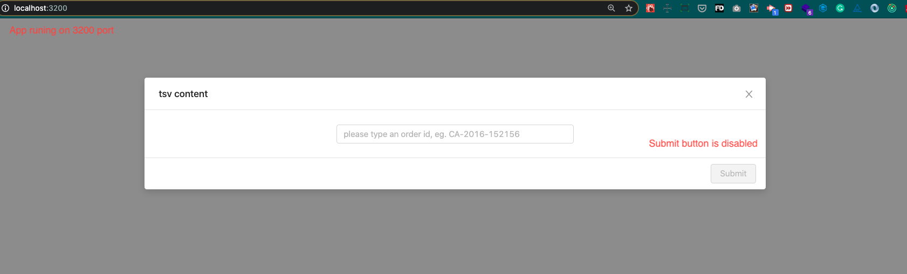
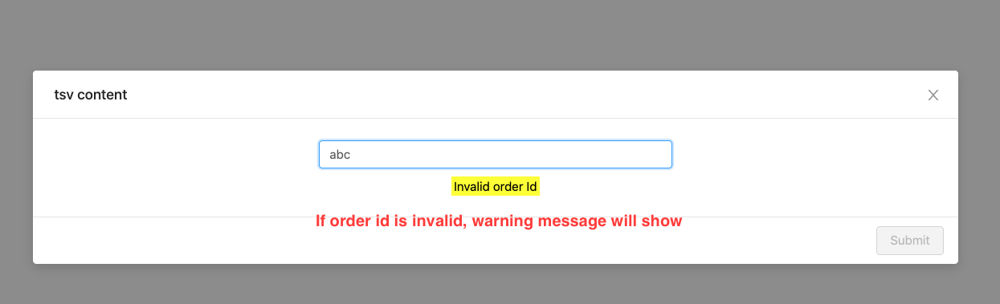
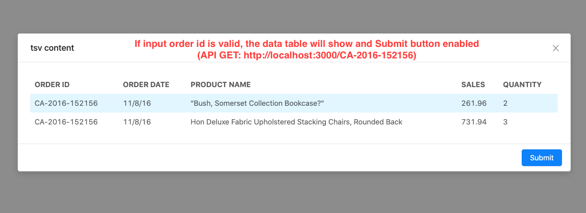
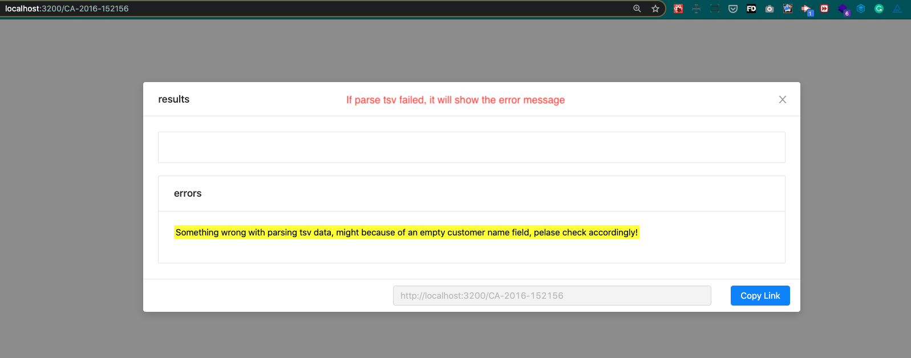
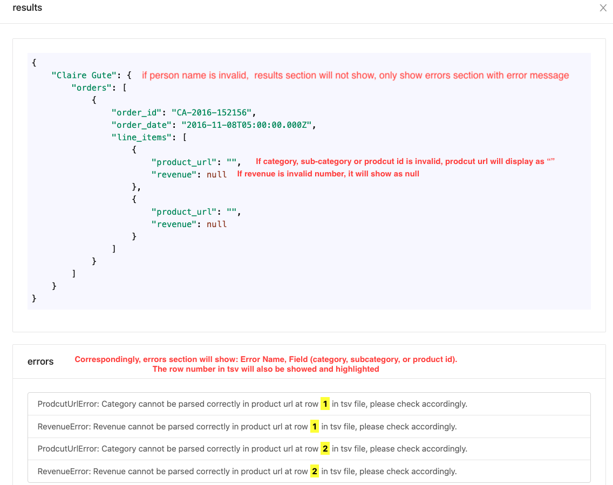
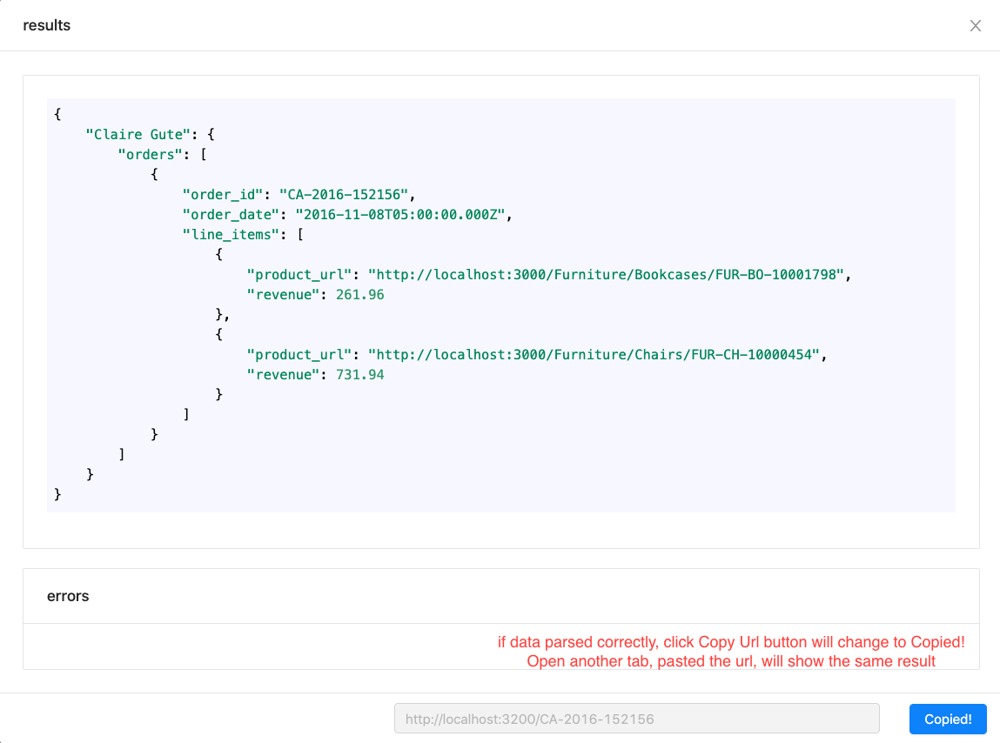

## Project Start Instruction:

Please make sure node.js has been installed

Clone this project to your local machine :

### `git clone https://github.com/zichenma/sales_management_backend.git`

Go in to the project folder:

### `cd sales_management_backend`

Install all dependencies:

### `npm install`

Start React Application Locally : 

### `npm run dev`

## Frontend part link:
(if you want to run front end part independently, please see the instruction for front end)

https://github.com/zichenma/sales_management_frontend.git

## Live Demo:

https://sales-management-zm.herokuapp.com/

## Visual Guide:

1. When the app stared, you should see:

2. When typing an invalid order id:

3. When input order id is valid (e.g. CA-2016-152156)

4. After click submit button, when parsing tsv data failed:

5. After click submit button, when parsing tsv data has errors:

6. After click submit button, when parsing tsv data desn't have errors:

